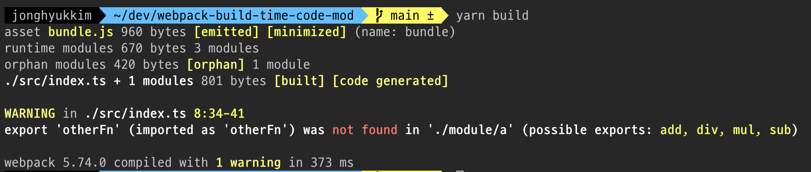

# webpack-build-time-code-mod

빌드타임에 코드 바꾸기 실험

- webpack custom loader
- webpack resolve
- code-mod에 사용할 도구 선택
  - SWC API와 AST
  - jscodeshift

# 한 거

## webpack resolve로 import source 바꾸기

하나의 Import source에 alias를 먹여서 아예 다른 import source로 빌드타임에 바꾸는 방법. `preact/compat`에서도 react 패키지와 인터페이스를 똑같이 만든 후에 webpack resolve 설정을 하는 방법으로 적용한다.

```js
// webpack.config.js
{
    resolve: {
      alias: {
        './module/a': './module/b',
      },
      extensions: ['.ts', '.tsx', '.js', '.json'],
    },
}
```

```shell
# A -> B, B -> A
IIFE 실행

I am module B add function
1 + 2 = 3

I am module B sub function
2 - 1 = 1

I am module B mul function
5 * 2 = 10

I am module B div function
4 / 2 = 2
```

걍 alias를 먹이는 것일 뿐이므로, 대체되는 import source와 기존 import source간의 export 인터페이스가 동일해야한다. 적어도 실제로 import해서 사용하고 있는 구현체에 대해서는.. 안그러면 빌드타임에 해당 코드를 찾을 수 없어 에러를 뿜게 된다. 당연한 이야기지만 머



## 기존의 import문 code-mod로 빌드타임에 수정하기

import source를 통째로 바꾸지 않고, 코드에서 사용하는 named export된 구현체의 일부는 A 패키지에서, 또다른 일부는 B 패키지에서 가져오는 식으로 빌드타임에 바꾸고 싶다면, 여기서부터는 code mod의 영역이라구 할 수 있다. 빌드타임에 코드를 바꿔야 한다.

### webpack loader + jscodeshift

원하는 형태로 되기는 된다.

```js
  module: {
    rules: [
      {
        test: /\.tsx?$/i,
        exclude: '/node_modules/',
        use: [
          {
            // 커스텀 로더
            loader: path.resolve(__dirname, './plugins/customLoader.js'),
            options: {
              // named export였던 것을 default export로 바꾸거나 하는 처리..? 도 가능하긴 하겠다
              // transform: default 옵션 같은걸 넣으면 될테지만 아직은 오버스펙처럼 보인다.
              named: {
                add: { from: './module/a', to: './module/b' },
                sub: { from: './module/a', to: './module/b' },
              },
              default: {},
            },
          },
          {
            loader: 'swc-loader', // webpack loader는 밑에서부터 실행, 즉 트랜스파일 이후에 커스텀 로더 적용
            options: { jsc: { parser: { syntax: 'typescript' } } },
          },
        ],
      },
    ],
  },
```

```shell
# 위 옵션에 명시된 add와 sub 함수만 B 모듈에서 import되는 것으로 바뀌었다

IIFE 실행

I am module B add function
1 + 2 = 3

I am module B sub function
2 - 1 = 1

I am module A mul function
5 * 2 = 10

I am module A div function
4 / 2 = 2

```

- AST를 이해할수는 있었지만 jscodeshift 독스가 좀 힘들다..
- 빌드 부하가 얼마나 될지 살펴봐야 하겠다

### SWC Plugin

- swc visit을 사용해서 소스코드에 접근 후 정규표현식으로 코드를 직접 수정하는 형태가 가능하다
- [swc-transform-plugin](https://github.com/ankitchouhan1020/swc-plugin-transform-import#readme)이라는 swc-loader의 플러그인 구현체가 그런 느낌으로 작성되었다.
- swc plugin + AST 직접 접근은 SWC 플러그인을 구현하면 가능할거 같은데 Rust로 써야하는듯 흑흑
